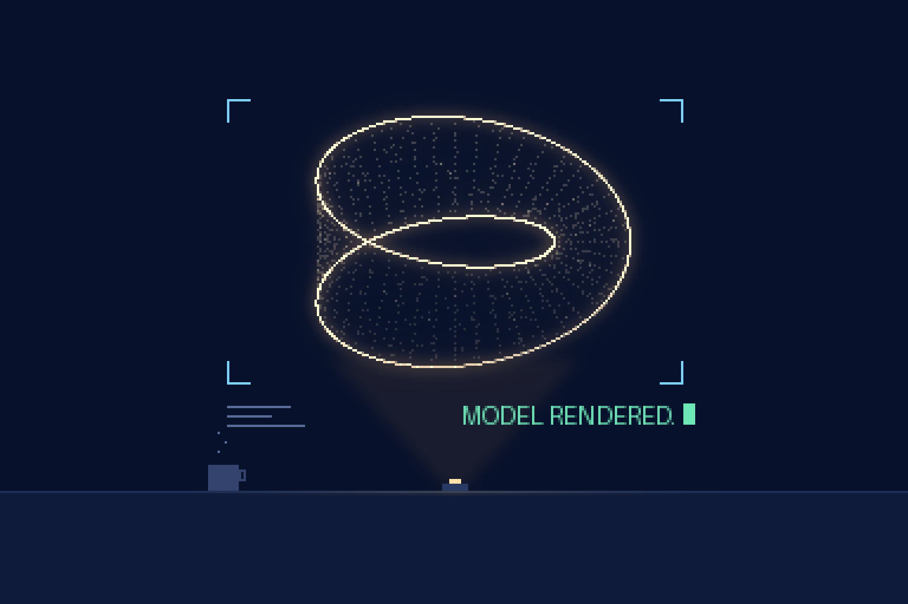

# friday

English | [한국어](README.ko.md)



An evidence-based collaboration mode for coding agents, named after Iron
Man's FRIDAY. Installed as a Claude Code plugin, it changes how the agent
answers ideas: every idea the human throws is restated as a falsifiable
proposition, adjudicated with the cheapest sufficient probe, and answered
with an explicit stance — for, against, or conditional — backed by evidence
collected in that run. No binary, no dependencies: the plugin is one skill.

## How it works

```
you: idea or direction
  ↓
[formalize]    restated as a falsifiable proposition — no interrogation
[adjudicate]   cheapest probe first: static analysis → worktree
               micro-prototype. verdict: FOR / AGAINST / CONDITIONAL,
               evidence cited
[prototype]    survivors + your nod → an artifact with measured numbers
[implement]    small changes done directly; large ones reported with the
               evidence and a plan
```

The mode stays on for the whole session, several ideas can sit in different
stages at once, and heavy probes run in background subagents — completion is
reported in one line, verdict first. Every idea lives on a board at
`.claude/friday/board.md`, dead ones included, so a long session can recover
its state after context loss.

## Why a stance, not a survey

An agent's cheapest output is agreeable analysis: three balanced paragraphs
that commit to nothing. friday forbids it. A verdict must take a side,
and its grounds must be evidence gathered in this run — file paths, command
output, measurements — never model prior knowledge alone. "We tried that"
needs a citation too, which is why refuted ideas stay on the board with the
evidence that killed them.

## Install

```
/plugin marketplace add janek-moon/friday
/plugin install friday@friday
```

Codex reads the same skill from `~/.codex/skills/verdict`, linked from a
checkout by `./install.sh`.

## Use

The skill (`skills/verdict/SKILL.md`, invoked as `/friday:verdict`)
switches the mode on for the session; from then on, just throw ideas. The
plugin never creates or edits repo docs (`AGENTS.md`, `CLAUDE.md`,
`.claude/rules/`) — it writes the board and nothing else.

## License

MIT
